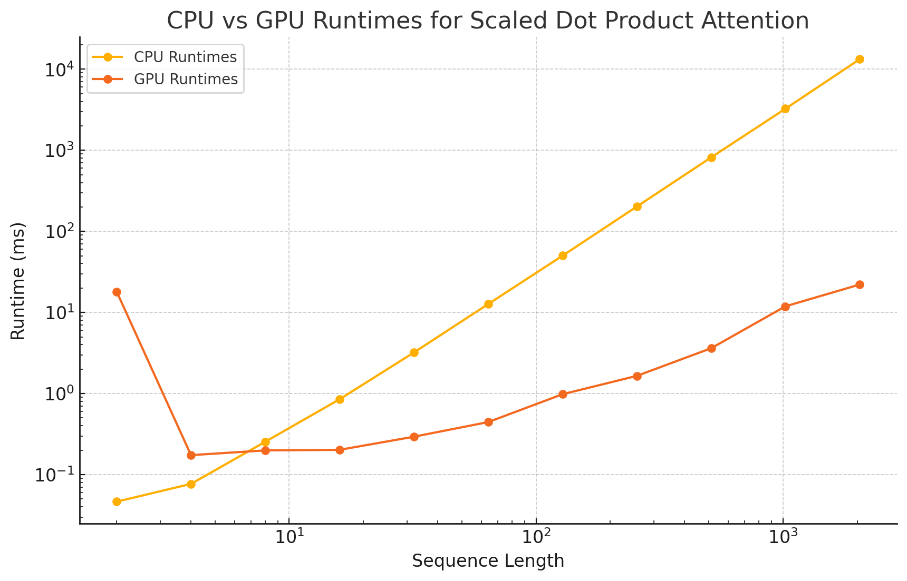
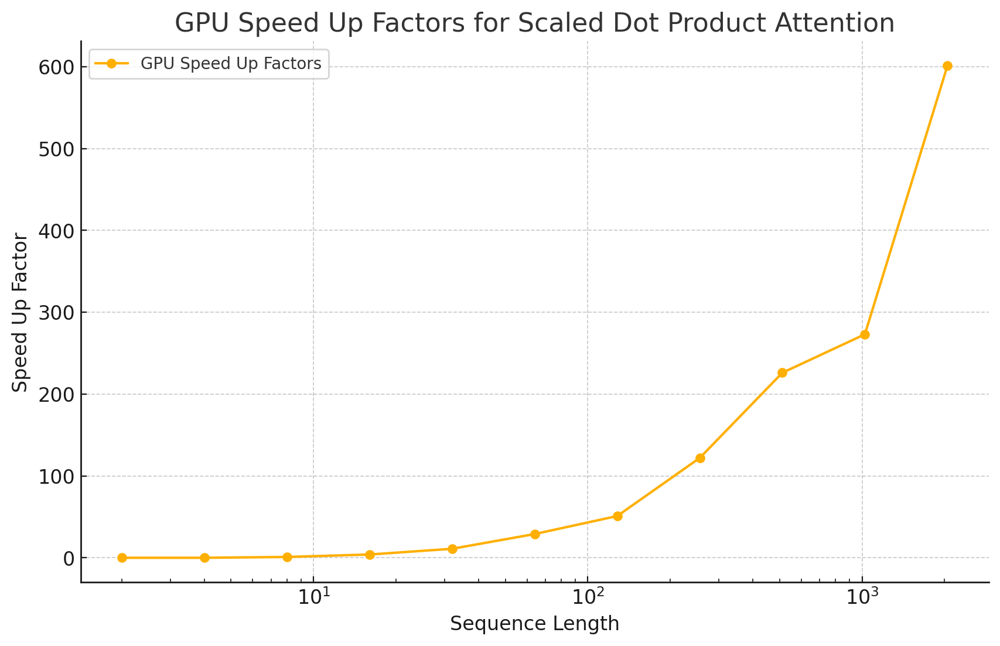
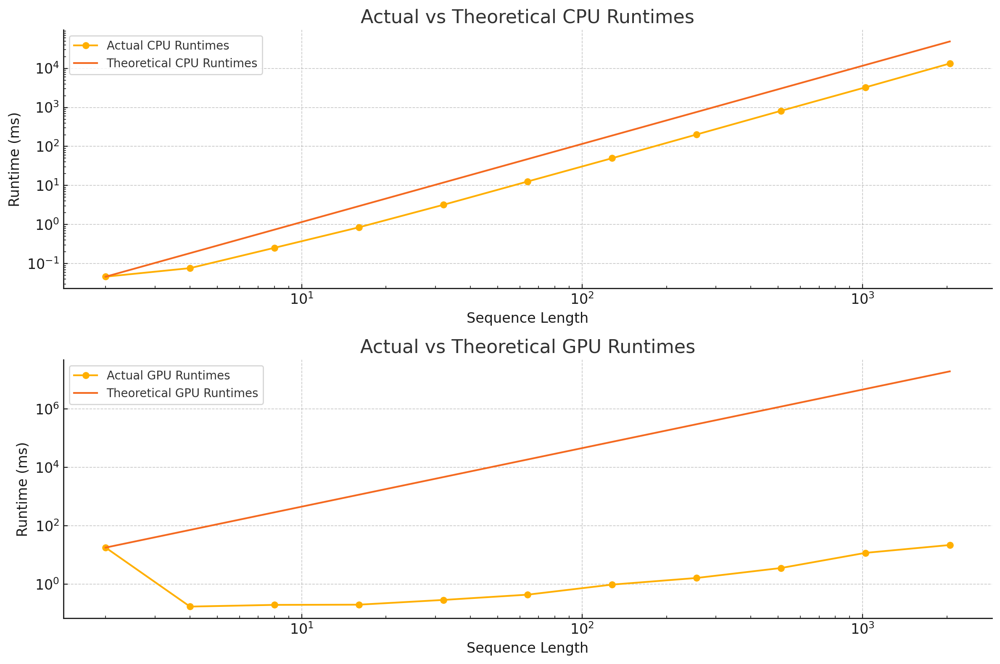

# Usage Instructions
Ensure that a GPU is connected and CUDA is installed. Run `make test`.

# Project Description

The Transfomer has revolutionized the Natural Language Processing (NLP) landscape and is the basis for the GPT models. Introduced by Vaswami et al. in the famous paper ["Attention Is All You Need"](https://arxiv.org/abs/1706.03762), Transfomers rely on the Attention mechanism to evaluate similarities between tokens in the input, leading to better language understanding and reasoning capabilities. 

In this project, we run the Attention mechanism both on the CPU and GPU. Given queries $Q \in \mathbb{R}^{n \times d}$, keys $K \in \mathbb{R}^{n \times d}$, and values $V \in \mathbb{R}^{n \times d}$, we implement scaled dot product attention according to the formula:

$$\text{Attention}(Q, K, V) = \frac{QK^T}{\sqrt{d}}V$$

We evaluate the run time of this formula on sequence lengths $n = 2, 4, \dots, 2048$ and an embedding dimension of $d = 128$ on both the CPU and GPU.

# Results

Below is an example of the program's output:

```
Sequence Length: 2
-------------------------

CPU-based scaledDotProductAttention runtime: 0.046432 ms
GPU-based scaledDotProductAttention runtime: 18.0533 ms
CPU and GPU outputs match
GPU speed up factor: 0x

Sequence Length: 4
-------------------------

CPU-based scaledDotProductAttention runtime: 0.076864 ms
GPU-based scaledDotProductAttention runtime: 0.174016 ms
CPU and GPU outputs match
GPU speed up factor: 0x

Sequence Length: 8
-------------------------

CPU-based scaledDotProductAttention runtime: 0.25456 ms
GPU-based scaledDotProductAttention runtime: 0.198976 ms
CPU and GPU outputs match
GPU speed up factor: 1x

Sequence Length: 16
-------------------------

CPU-based scaledDotProductAttention runtime: 0.85088 ms
GPU-based scaledDotProductAttention runtime: 0.202304 ms
CPU and GPU outputs match
GPU speed up factor: 4x

Sequence Length: 32
-------------------------

CPU-based scaledDotProductAttention runtime: 3.20752 ms
GPU-based scaledDotProductAttention runtime: 0.293504 ms
CPU and GPU outputs match
GPU speed up factor: 11x

Sequence Length: 64
-------------------------

CPU-based scaledDotProductAttention runtime: 12.692 ms
GPU-based scaledDotProductAttention runtime: 0.4448 ms
CPU and GPU outputs match
GPU speed up factor: 29x

Sequence Length: 128
-------------------------

CPU-based scaledDotProductAttention runtime: 50.086 ms
GPU-based scaledDotProductAttention runtime: 0.980704 ms
CPU and GPU outputs match
GPU speed up factor: 51x

Sequence Length: 256
-------------------------

CPU-based scaledDotProductAttention runtime: 202.159 ms
GPU-based scaledDotProductAttention runtime: 1.65187 ms
CPU and GPU outputs match
GPU speed up factor: 122x

Sequence Length: 512
-------------------------

CPU-based scaledDotProductAttention runtime: 816.558 ms
GPU-based scaledDotProductAttention runtime: 3.61859 ms
CPU and GPU outputs match
GPU speed up factor: 226x

Sequence Length: 1024
-------------------------

CPU-based scaledDotProductAttention runtime: 3253.64 ms
GPU-based scaledDotProductAttention runtime: 11.9047 ms
CPU and GPU outputs match
GPU speed up factor: 273x

Sequence Length: 2048
-------------------------

CPU-based scaledDotProductAttention runtime: 13280.6 ms
GPU-based scaledDotProductAttention runtime: 22.0967 ms
CPU and GPU outputs match
GPU speed up factor: 601x
```

# Performance Analysis

On sequences lengths of 8 and greater, the GPU implementation yields an improvement in runtime.



Furthermore, the speed up factor exponentially increases. At $n = 2048$ the speed up is over 600 times!



A large disadvantage of the Transformer model is that the Attention mechanism runs in $O(n^2)$, where $n$ is the length of the input sequence. We see that although the CPU implementation follows this trend, the GPU implementation does not. 



There is work that demonstrates how to better utilize the GPU to compute Attention. [Flash Attention](https://arxiv.org/abs/2205.14135) tiles the large $n \times n$ matrices and copies the tiles to shared memory for faster access and therefore lower runtime.

From this project, it appears to be very clear that GPUs should be used whenever running the Attention mechanism. 

